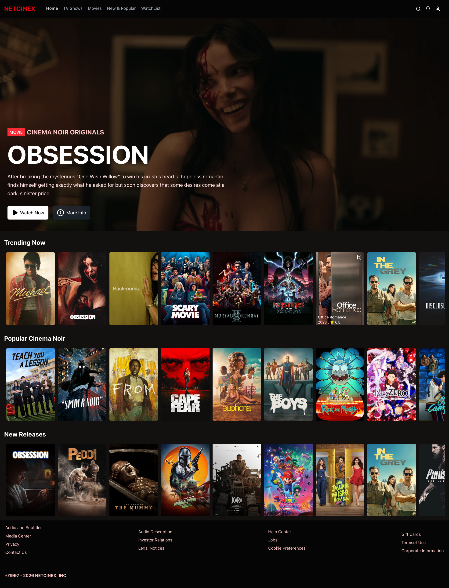

# 🎬 NETCINEX
This is a movie app built with React and Vite. It uses the TMDB API to fetch movie data and display it in a grid. The app is responsive and uses Tailwind CSS for styling. It also includes a search feature that allows users to search for movies and tv shows by title or name.

---
## ✨ Features

- **🔍 Advanced Movie and TV show Search** -  Seach through millions of videos from the TMDB
- **📖 Movie and TV show Details** - View comprehensive information about each movie and tv show, including the title, backdrop, time and other information about the movie
- **❤️ Favorites Management** - Save your favorite movies and tv shows to your watchlist, and watch later
- **📋 Watch List** -  Create and manage your own personal saved movies and tv show 
- **📱 Responsive Design** - Built with modern tools and optimized for speed with React Query caching
- **⚡ Fast & Performant** - Clean, intuitive interface designed with Tailwind CSS

---
##  🛠️ Tech Stack

- **Frontend Framework**: React 19 with TypeScript
- **Build Tool**: Vite
- **Styling**: Tailwind CSS
- **Routing**: React Router v7
- **State Management & Caching**: TanStack React Query (React Query)
- **Icons**: Lucide React
- **Linting**: ESLint
- **Testing**: Vitest
- **API Source**: TMDB API

## 📦 Installation

### Prerequisites
- Node.js (v16 or higher)
- npm or yarn package manager

### Steps

1. **Clone the repository**
```bash 
git clone git@github.com:komoforbrandon/MovieApp.git
cd MovieApp
```

2. **Install dependencies**
```bash
npm install
```

3. **Start the development server**
```bash
npm run dev
```

The application will open in your default browser at `http://localhost:5173`

---

## 📷 Example Output



---
## 🚀 Getting Started

1. **Search for a Movie or Tv Show** - Search for movies and tv shows by title or name
2. **View Movie or Tv Show Details** - View detailed information about a movie or tv show, including the title, backdrop, time and other information about the movie
3. **Save Favorites** - Save your favorite movies and tv shows to your watchlist, and watch later
4. **Manage Watch List** - Create and manage your own personal saved movies and tv show 
5. **Responsive Design** - Built with modern tools and optimized for speed with React Query caching
6. **Fast & Performant** - Clean, intuitive interface designed with Tailwind CSS

---

## 📁 Project Structure

```
src/
├── components/
│   ├── common/              # Reusable components
│   │   ├── videoCard.tsx     # display individaul video card
│   │   ├── VidDetailsCard.tsx  # display video details
│   │   ├── searchDetailsCard.tsx   # display search details
│   │   ├── movieLoader.tsx       # Loading spinner
│   │   ├── tvLoader.tsx       # Loading spinner
│   │   └── searchbar.tsx    # Search input component
│   └── layout/              # Layout components
│       ├── navbar.tsx       # Navigation bar
│       ├── herosection.tsx         # Hero section
│       └── footer.tsx       # Footer component
├── pages/                   # Page components
│   ├── Home.tsx            # Home/search page
│   ├── Tvshow.tsx          # Tv show page
│   ├── Movies.tsx          # Movie page
│   ├── MovieDetails.tsx    # Movie details page
│   ├── Watchlist.tsx       # Watchlist page
│   └── popular.tsx         # Popular movies page
├── hooks/                  # Custom React hooks
│   ├── useFavorites.ts     # Favorites management hook
│   └── saveBook.tsx        # Book persistence context
├── services/               # API and external services
│   └── api.ts             # Open Library API integration
├── types/                  # TypeScript type definitions
│   └── type.ts            # App-wide types
└── routes/                # Routing configuration
    └── AppRoutes.tsx      # Route definitions

```

## 🔧 Available Scripts

- `npm run dev` - Start the development server
- `npm run build` - Build for production
- `npm run preview` - Preview the production build
- `npm run lint` - Run ESLint to check code quality

---

## API Integration

The application integrates with the TMDB API to fetch movie and tv show data. You can find more information about the API [here](https://developers.themoviedb.org/3/getting-started/introduction).

---

## 📝 License

This project is released under the [MIT License](https://opensource.org/licenses/MIT).

## 🤝 Contributing

Contributions are welcome! Feel free to:
1. Fork the repository
2. Create a feature branch (`git checkout -b dev`)
3. Commit your changes (`git commit -m 'Add some AmazingFeature'`)
4. Push to the branch (`git push origin dev`)
5. Open a Pull Request

---

## 🌟 Acknowledgments

- [Tailwind CSS](https://tailwindcss.com/)
- [Lucide React](https://lucide.dev/)
- [React Query](https://tanstack.com/query/v4)
- [TMDB API](https://developers.themoviedb.org/3/getting-started/introduction)  
- [React Router](https://reactrouter.com/en/main)
- [Vite](https://vitejs.dev/)
- [Vitest](https://vitest.dev/)
- [Rebase Code Camp](https://rebasecodecamp.com/)

---

## 👨‍💻 Author

- Brandon Komofor [github](https://github.com/komoforbrandon), [linkedin](https://www.linkedin.com/in/komofor-brandon-nghoneyi-151486396/)

---